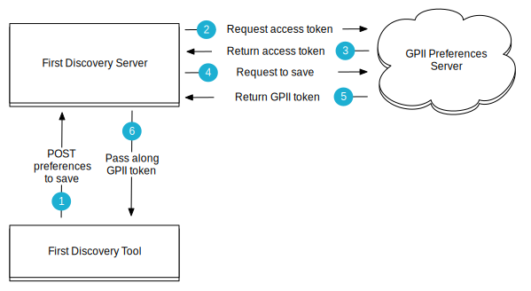

The First Discovery Tool supports integration with the [GPII Preferences Server](https://github.com/GPII/universal/blob/master/documentation/PreferencesServer.md) to save user selected preferences. The First Discovery Tool has been designed for users who are new to the concept of user interface customization and setting preferences. It is assumed that users will not already have any preferences stored on the GPII Preferences Server and that the First Discovery Tool will walk them through the process of creating their first preference set. This integration will save the selected preferences to the GPII Preferences server and return a token to the user. The token will allow the user to retrieve the saved preferences when needed.

**Note**: While this document focuses on integration with the GPII Preferences Server, the First Discovery Tool could be integrated with any data store to save a user's preferences.

## The First Discovery Server

The GPII Preferences Server provides the [OAuth2 Client Credentials Grant API](https://wiki.gpii.net/w/GPII_OAuth_2_Guide#Client_Credentials_Grant) to securely save preferences. This API requires the client ID and secret to be included in the http request for OAuth authentication. Because this sensitive information must be sent server-to-server, the First Discovery Tool uses a separate server – the First Discovery Server – to mediate the exchange.

What it does:

* serves the First Discovery Tool
* receives http requests sent from the First Discovery Tool. These requests only contain user selected preferences
* follows the [OAuth2 Client Credentials Grant API](https://wiki.gpii.net/w/GPII_OAuth_2_Guide#Client_Credentials_Grant) to send user selected preferences to the GPII Preferences Server, and
* sends the GPII token returned by the GPII Preferences Server to the First Discovery Tool 

## Demos

This demo implements the integration with the [GPII Preferences Server](https://github.com/GPII/universal/blob/master/documentation/PreferencesServer.md) to save preferences.
http://build.fluidproject.org/first-discovery/demos/prefsServerIntegration

## Source code

* [Client (First Discovery Tool)](https://github.com/GPII/first-discovery)
* [Server (First Discovery Server) - under development](https://github.com/GPII/first-discovery-server)
* [GPII Preferences Server](https://github.com/GPII/universal)
